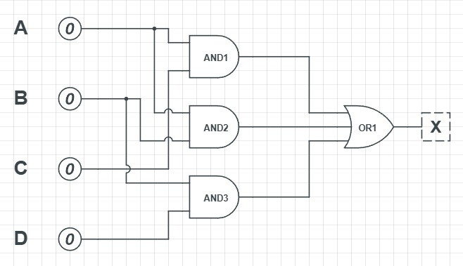

# Global Solution - Computer Science

## 📝 Sobre o Projeto
O objetivo deste projeto é desenvolver um sistema de alarme baseado em lógica digital. Esse sistema funciona em conjunto com um modelo preditivo de Inteligência Artificial, que é capaz de antecipar eventos climáticos extremos. O modelo de IA analisa dados meteorológicos e gera diferentes variáveis binárias (0 ou 1) que representam os riscos identificados. A partir dessas variáveis, o sistema lógico deve acionar um alarme (`X=1`) quando uma situação de risco climático for determinada.

---

## 1. Definição das Variáveis de Entrada
Para esta versão padrão do projeto, utilizamos as 4 variáveis de entrada sugeridas como exemplo no desafio técnico:

* **A:** Chuvas intensas detectadas (`0`=não, `1`=sim)
* **B:** Vento forte detectado (`0`=não, `1`=sim)
* **C:** Umidade do solo muito alta (`0`=não, `1`=sim)
* **D:** Temperatura extremamente elevada (`0`=não, `1`=sim)

---

## 2. Expressão Lógica do Alarme
As regras de risco são baseadas diretamente nos exemplos possíveis do documento:

* Se houver **chuva intensa (A) E umidade do solo alta (C)**, há risco de enchente.
* Se houver **vento forte (B) E chuva intensa (A)**, há risco de desabamento.
* Se houver **temperatura elevada (D) E vento forte (B)**, há risco de incêndio.

### Expressão Lógica (Completa e Simplificada)
A expressão que une as regras acima é `X = (A·C) + (A·B) + (B·D)`. Esta expressão já se encontra em sua forma mais simples e, portanto, atende aos requisitos de apresentar tanto a versão completa quanto a simplificada.

---

## 3. Tabela Verdade
A seguir, a tabela verdade completa para a lógica do projeto.

| A | B | C | D | **X (Alarme)** |
|:---:|:---:|:---:|:---:|:---:|
| 0 | 0 | 0 | 0 | **0** |
| 0 | 0 | 0 | 1 | **0** |
| 0 | 0 | 1 | 0 | **0** |
| 0 | 0 | 1 | 1 | **0** |
| 0 | 1 | 0 | 0 | **0** |
| 0 | 1 | 0 | 1 | **1** |
| 0 | 1 | 1 | 0 | **0** |
| 0 | 1 | 1 | 1 | **1** |
| 1 | 0 | 0 | 0 | **0** |
| 1 | 0 | 0 | 1 | **0** |
| 1 | 0 | 1 | 0 | **1** |
| 1 | 0 | 1 | 1 | **1** |
| 1 | 1 | 0 | 0 | **1** |
| 1 | 1 | 0 | 1 | **1** |
| 1 | 1 | 1 | 0 | **1** |
| 1 | 1 | 1 | 1 | **1** |

---

## 4. Projeto do Circuito Lógico 🔌
O diagrama do circuito lógico abaixo representa fisicamente a expressão booleana do sistema de alarme.



---

## 5. Implementação e Simulação 💻
Os códigos abaixo permitem a validação e simulação do sistema.

### Programa em Python com Tabela Verdade
```python
# Gera a tabela verdade completa com 16 linhas para a lógica padrão.
print("A | B | C | D | X (Saída)")
print("--|---|---|---|----------")

for a in range(2):
    for b in range(2):
        for c in range(2):
            for d in range(2):
                # Aplica a expressão lógica padrão: X = (A·C) + (A·B) + (B·D)
                x = (a and c) or (a and b) or (b and d)
                print(f"{a} | {b} | {c} | {d} |    {int(x)}")
```

### Simulação em Arduino com Programa em C++
```c++
/*
 * Este código implementa a lógica padrão do projeto em um Arduino.
*/

// Mapeamento dos Pinos de Entrada para os Sensores
const int pinoA = 2; // Sensor de Chuva Intensa
const int pinoB = 3; // Sensor de Vento Forte
const int pinoC = 4; // Sensor de Umidade do Solo
const int pinoD = 5; // Sensor de Temperatura Elevada

// Mapeamento do Pino de Saída para o Alarme
const int pinoAlarmeX = 13; // LED no pino 13

void setup() {
  pinMode(pinoA, INPUT); pinMode(pinoB, INPUT);
  pinMode(pinoC, INPUT); pinMode(pinoD, INPUT);
  pinMode(pinoAlarmeX, OUTPUT);
}

void loop() {
  bool a = digitalRead(pinoA);
  bool b = digitalRead(pinoB);
  bool c = digitalRead(pinoC);
  bool d = digitalRead(pinoD);
  
  bool ativarAlarme = (a && c) || (a && b) || (b && d);
  
  digitalWrite(pinoAlarmeX, ativarAlarme);
  delay(100);
}
```
## 6. Explicação do Funcionamento 💡

Este sistema de alarme climático utiliza quatro sensores digitais para monitorar fatores de risco. As entradas representam chuva intensa (A), vento forte (B), umidade do solo (C) e temperatura elevada (D). Um circuito de lógica digital processa esses sinais em tempo real. A lógica foi programada com regras de perigo específicas baseadas em combinações de risco, conforme os exemplos do projeto.

Por exemplo, o risco de enchente é detectado se houver chuva e umidade alta (A e C). Da mesma forma, outras regras monitoram o risco de desabamento (A e B) e de incêndio (B e D). Se qualquer uma dessas combinações se tornar verdadeira, a expressão lógica resulta em um sinal de saída (X=1). Este sinal ativa um alarme físico, como um LED ou sirene, para alertar sobre o perigo. O objetivo final é antecipar eventos climáticos extremos e permitir uma resposta rápida.